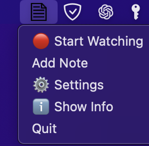
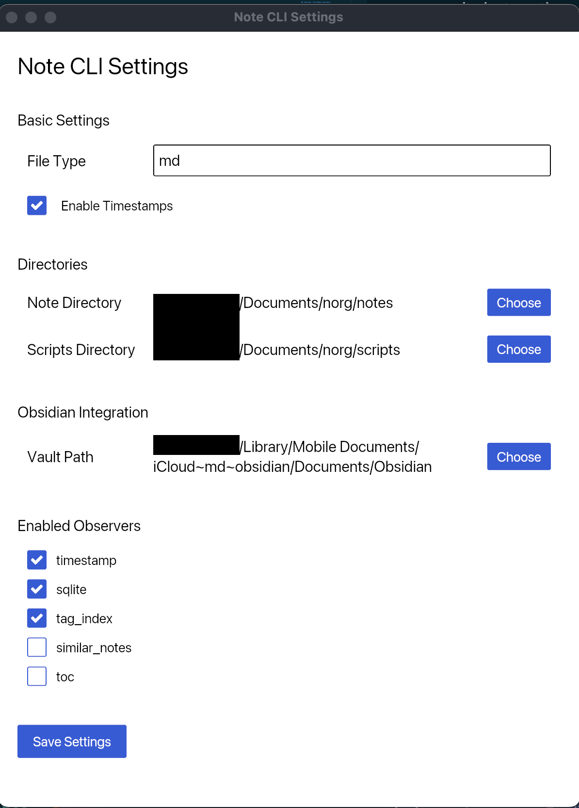

# Welcome to Noorg

Let's discover **Noorg in less than 5 minutes**.


## Getting Started

Get started by **installing the prerequisites**.

### What you'll need

- [Rust and Cargo](https://rustup.rs/)
- Python 3.9+
- Lua 5.4

## Installation

:warning: **Noorg is currently only supported on macOS.**

1. Install Rust and Cargo:
```bash
# macOS
curl --proto '=https' --tlsv1.2 -sSf https://sh.rustup.rs | sh
```

2. Clone and install Noorg:
```bash
git clone https://github.com/realjockel/noorg.git
cd noorg
```

```bash
./install.sh
```
Uninstall with:

```bash
./install.sh uninstall
```
3. Install Python dependencies:
```bash 
brew install python@3.9

# Add to ~/.zshrc or ~/.bashrc
export PYTHON_CONFIGURE_OPTS="--enable-framework"
export PYO3_PYTHON="/opt/homebrew/opt/python@3.9/bin/python3.9"
```
4. Install Lua

```bash
brew install lua # macOS
# find lua path
lua -e "print(package.path:match('([^;]+)/?.lua'))"
# macOS: Copy to Lua package path
sudo cp json.lua /opt/homebrew/share/lua/5.4/json.lua

# Verify installation
lua -e "require('json')"
```

## Start Using Noorg

Run the system tray application:

```bash
noorg
```
This opens the Noorg system tray application. You can now interact with Noorg using the system tray icon. In the system tray, you can create a note, start the watcher, and open the settings window to configure Noorg.


### Settings
Open the settings window to configure Noorg.


- **File Type**: The file type for your notes (Markdown, Org, etc.).
- **Notes Directory**: The directory where your notes are stored.
- **Script Directory**: The directory where your scripts are stored. (Python and Lua)
- **Obsidian Integration**: If you want to create notes with the note_cli and open Obsidian, you have to set the vault_path and enable. You also have to enable `Allow URI callbacks` in Obsidian settings. `Settings -> Files and Links -> Allow URI callbacks`.
- Enabled Observers: Enable or disable default RUST based observers. (Python and Lua observers are not included in this list)


### Create your first note:
There are multiple ways to create a note with Noorg. You can use the system tray application, the CLI, or your favorite text editor.

Create a note with the system tray application:
1. Click on the system tray icon.
2. Click on "Create Note".
3. Enter the title of your note.

Create a note with the CLI:

- `title`: The title of the note.
- `body`: The body of the note.
- `fields`: Additional fields for the note. Those are saved as front matter in the note file.


```bash
noorg note_cli add --title "My First Note" --body "Hello Noorg!" -f "priority:high" -f "project:X"
```

Create a note with your favorite text editor:

You can create a note with your favorite text editor and save it in your notes directory. Noorg will automatically process your note.

or you can use noorg note_cli add to create a note with your favorite text editor:
```bash
noorg note_cli add --title "My First Note"  -f "priority:high" -f "project:X"
```

You simply have to remove the --body argument and Noorg will open your default text editor to write the body of the note.

Setting the Editor:
```bash
export EDITOR=nvim
```

### Watch your notes directory

Watch your notes directory for changes with the CLI:

Start the watcher with:
- Systen Tray Application
- CLI

```bash
noorg note_cli watch
```


Open your favorite text editor and start writing in Markdown. Noorg will automatically process your notes as you write them.

### Import  notes and sync with Noorg

If you have already created notes, you can import them into your notes directory and sync them with Noorg to run all observers.

```bash
noorg note_cli sync
```

## What's Next?

- Try out different observers and automation features
- Extend functionality with Python, Lua, or Rust
